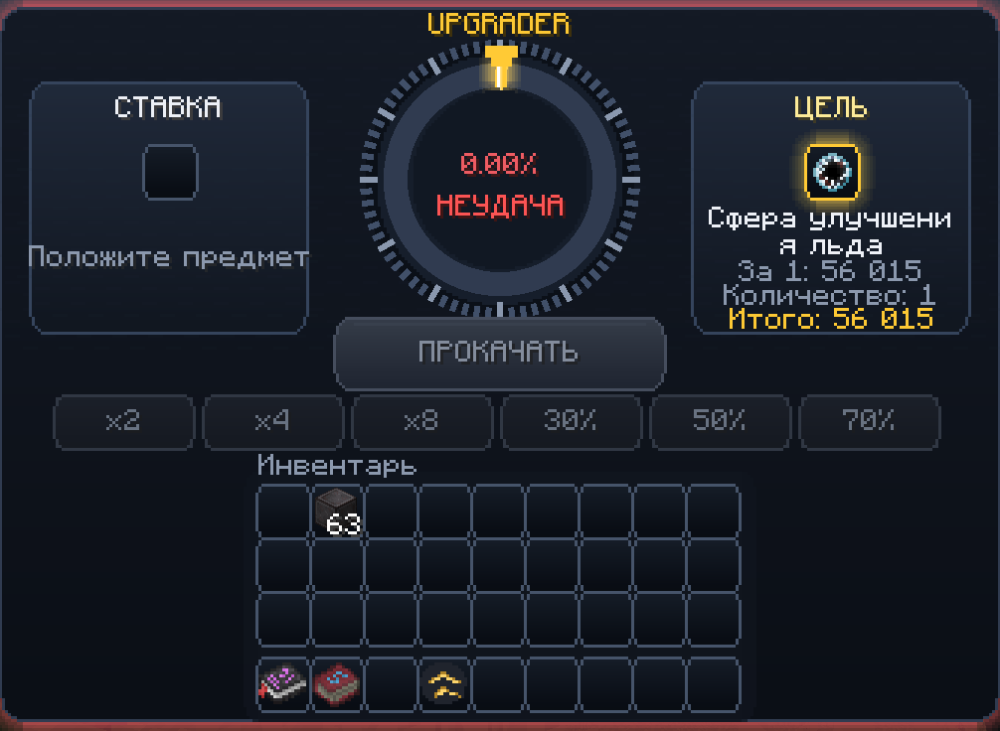
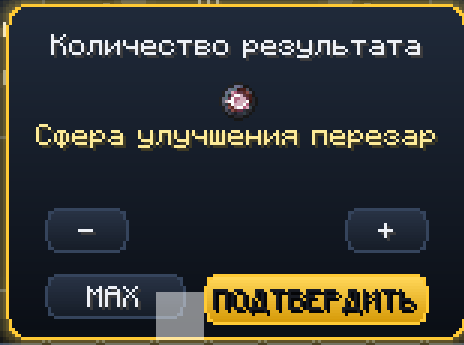
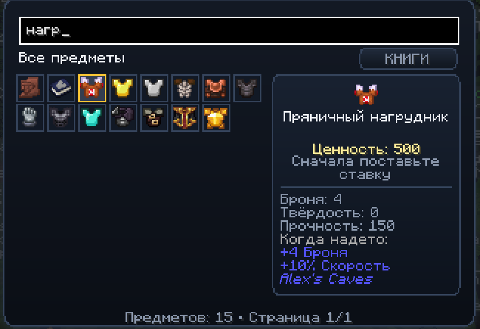

# Upgrader for Minecraft Forge 1.20.1

Turn spare loot into a chance at something better.

Upgrader adds a casino-style item upgrade screen to Minecraft. Place an item as your wager, choose what you want to get, check the chance and spin the wheel. If the marker lands in the gold zone, you win the chosen item. If it misses, you lose the wager.



## About this version

This is a rebuilt and expanded version of [the original Upgrader Items mod](https://www.curseforge.com/minecraft/mc-mods/upgrader-items) by **execheinz**. The original idea and version 1.0 belong to its author. You can find the original Forge file [here](https://www.curseforge.com/minecraft/mc-mods/upgrader-items/files/8535512).

Version 1.1 keeps the same main idea but fixes the problems found in version 1.0. The menu was rebuilt, the value system now works with many modded items, stackable rewards have a separate amount window, and upgrade attempts are protected from double clicks and repeated packets.

## Features

- Six upgrade presets: `x2`, `x4`, `x8`, `30%`, `50%` and `70%`.
- Separate quantity selector for stackable rewards, from 1 to 64.
- Searchable target catalogue with values, combat stats and current win chance.
- Vanilla and modded enchanted books at every valid level.
- Recipe-aware values for vanilla and modded items.
- Support for enchantments, rarity, durability, attributes, Apotheosis affixes, sockets and meaningful NBT.
- Protected server-side attempts with replay and double-click prevention.
- Rewards go directly to the inventory; overflow is safely dropped beside the player.
- Smooth 4.4-second wheel animation, casino-style menu sounds and victory fireworks.
- Technical, creative-only and unobtainable rewards are filtered on the server.

## How to use

1. Install **Minecraft 1.20.1** and **Forge 47.x**.
2. Put `upgrader-1.1.jar` into the `mods` folder. In multiplayer, install the same file on the host/server and every player.
3. Craft the Upgrader with four gold ingots, four diamonds and an anvil in the centre.
4. Hold the Upgrader and right-click to open it.
5. Put your wager in the left slot.
6. Click the target slot to search for a reward, or use one of the six preset buttons.
7. For stackable rewards, choose the exact quantity. Non-stackable equipment always gives one item.
8. Check the displayed chance and press **Upgrade**.





## Crafting recipe

```text
G D G
D A D
G D G

G = Gold Ingot
D = Diamond
A = Anvil
```

## Compatibility

- Minecraft 1.20.1
- Forge 47.x
- Singleplayer, dedicated servers and e4mc/LAN hosts
- Designed to work with large modpacks without requiring hard dependencies

Dedicated value rules are included for Apotheosis/Apothic Attributes, Artifacts, Relics, Simply Swords, Iron's Spells 'n Spellbooks, Born in Chaos, Mowzie's Mobs, Alex's Caves, Mutant Monsters and Passive Skill Tree. Unknown mods fall back to generic recipe, rarity, attribute and item-type rules. A broken third-party item or recipe is isolated instead of crashing the whole catalogue.

## О моде

Это доработанная версия [оригинального мода Upgrader Items](https://www.curseforge.com/minecraft/mc-mods/upgrader-items) от **execheinz**. Оригинальная идея и версия 1.0 принадлежат автору. Скачать исходную версию для Forge можно [здесь](https://www.curseforge.com/minecraft/mc-mods/upgrader-items/files/8535512).

Upgrader добавляет в Minecraft 1.20.1 улучшение предметов в стиле игрового казино. Положите ставку, выберите желаемую вещь, посмотрите шанс и запустите колесо. Если указатель остановится в золотой зоне, вы получите выбранный предмет. Если нет, ставка пропадёт.

Стакаемые предметы можно выбирать в количестве от 1 до 64. Для оружия, брони, инструментов, артефактов и других предметов с размером стака 1 результат всегда один. Каталог показывает название, ценность, характеристики и шанс получения.

### Что изменилось в версии 1.1

- Новый интерфейс в стиле казино.
- Исправлены вылеты при работе со слотом ставки.
- Кнопки `x2`, `x4`, `x8`, `30%`, `50%` и `70%` снова отвечают за режим улучшения.
- Для стакаемых вещей добавлен отдельный выбор количества от 1 до 64.
- Добавлены поиск, описание, характеристики, ценность и шанс получения предмета.
- Переработан расчёт ценности обычных и модовых вещей.
- Добавлены зачарованные книги с разными чарами и уровнями.
- Исправлены дюпы, повторная выдача награды и двойное списание ставки.
- Награда сразу попадает в инвентарь. Если места нет, она выпадает рядом с игроком.
- Недоступные в выживании предметы больше нельзя выбрать как награду.
- Каталог стал легче и меньше просаживает FPS.
- Добавлены плавная анимация, звуки меню и фейерверки при победе.

## Configuration

The common Forge config contains:

- player advantage and minimum/maximum chance;
- animation duration;
- target blacklist and survival allowlist;
- manual values in the form `namespace:item=value`.

## License

All Rights Reserved. You may use the released JAR in personal modpacks and servers. Redistribution, modified uploads and commercial resale require permission from the author.
