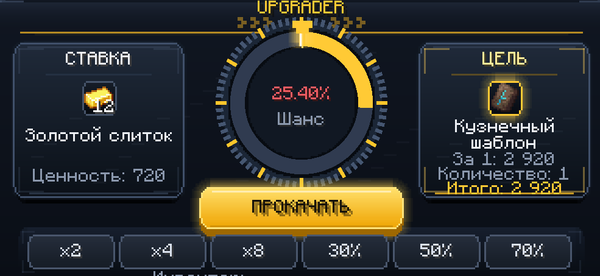
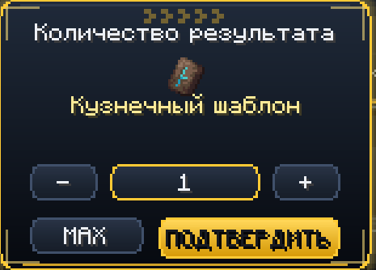
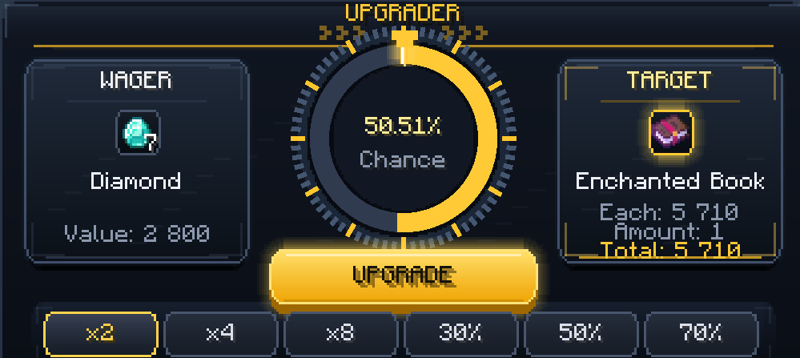
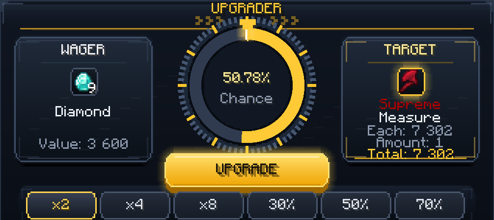

# Upgrader for Minecraft Forge 1.20.1

[Русский](#русский) | [English](#english)

## Русский

Upgrader добавляет улучшение предметов в стиле игрового казино. Положите вещь как ставку, выберите награду, посмотрите шанс и запустите колесо. Если указатель остановится в золотой зоне, вы получите выбранный предмет. Если нет, ставка пропадёт.

Это доработанная версия [оригинального Upgrader Items](https://www.curseforge.com/minecraft/mc-mods/upgrader-items) от **execheinz**. Исходную версию 1.0 для Forge можно скачать [здесь](https://www.curseforge.com/minecraft/mc-mods/upgrader-items/files/8535512).



### Что есть в версии 1.1

- Шесть режимов улучшения: `x2`, `x4`, `x8`, `30%`, `50%` и `70%`.
- Отдельный выбор количества только для стакаемых наград, от 1 до 64.
- Поиск предметов и зачарованных книг.
- В каталоге видны название, ценность, характеристики и текущий шанс.
- Цена считается по рецептам, редкости, характеристикам, чарам и важным данным предмета.
- Недоступные в выживании предметы нельзя выбрать как награду.
- Сервер защищает попытку от двойного клика, повторного пакета и двойной выдачи.
- Награда попадает в инвентарь. Если места нет, она безопасно выпадает рядом.
- Плавная анимация колеса, звуки меню и фейерверки при победе.



### Как пользоваться

1. Установите Minecraft 1.20.1 и Forge 47.x.
2. Положите `upgrader-1.1.jar` в папку `mods`.
3. В сетевой игре установите тот же файл на сервер или e4mc-хост и всем игрокам.
4. Создайте Upgrader из четырёх золотых слитков, четырёх алмазов и наковальни.
5. Возьмите Upgrader в руку и нажмите правую кнопку мыши.
6. Положите ставку, выберите награду и нажмите кнопку улучшения.

### Крафт

```text
G D G
D A D
G D G

G = золотой слиток
D = алмаз
A = наковальня
```

### Совместимость

- Minecraft 1.20.1
- Forge 47.x
- Одиночная игра, обычный сервер, LAN и e4mc
- Мод не требует другие моды для запуска

Есть отдельные правила ценности для Apotheosis, Apothic Attributes, Artifacts, Relics, Simply Swords, Iron's Spells 'n Spellbooks, Born in Chaos, Mowzie's Mobs, Alex's Caves, Mutant Monsters и Passive Skill Tree. Остальные моды оцениваются по общим правилам.

---

## English

Upgrader adds casino-style item upgrades to Minecraft. Place an item as your wager, choose a reward, check the chance and spin the wheel. If the pointer stops in the gold zone, you get the selected item. If it misses, the wager is lost.

This is a rebuilt and expanded version of [the original Upgrader Items](https://www.curseforge.com/minecraft/mc-mods/upgrader-items) by **execheinz**. The original Forge 1.0 file is available [here](https://www.curseforge.com/minecraft/mc-mods/upgrader-items/files/8535512).



### Features in version 1.1

- Six upgrade modes: `x2`, `x4`, `x8`, `30%`, `50%` and `70%`.
- A separate amount selector for stackable rewards, from 1 to 64.
- Searchable item and enchanted book catalogue.
- Item name, value, equipment stats and current win chance are shown.
- Values use recipes, rarity, stats, enchantments and important item data.
- Creative-only and unobtainable rewards are blocked.
- Server protection against double clicks, repeated packets and duplicate rewards.
- Rewards go to the inventory or drop safely beside the player when it is full.
- Smooth wheel animation, menu sounds and victory fireworks.



### How to use

1. Install Minecraft 1.20.1 and Forge 47.x.
2. Put `upgrader-1.1.jar` in the `mods` folder.
3. For multiplayer, install the same file on the server or e4mc host and every player.
4. Craft the Upgrader with four gold ingots, four diamonds and an anvil.
5. Hold the Upgrader and right-click.
6. Place your wager, choose a reward and press Upgrade.

### Crafting recipe

```text
G D G
D A D
G D G

G = Gold Ingot
D = Diamond
A = Anvil
```

### Compatibility

- Minecraft 1.20.1
- Forge 47.x
- Singleplayer, dedicated servers, LAN and e4mc
- No required mod dependencies

Extra value rules are included for Apotheosis, Apothic Attributes, Artifacts, Relics, Simply Swords, Iron's Spells 'n Spellbooks, Born in Chaos, Mowzie's Mobs, Alex's Caves, Mutant Monsters and Passive Skill Tree. Other mods use common recipe, rarity, item type and attribute rules.

## License

All Rights Reserved. You may use the official JAR in personal modpacks and servers. Reuploading modified files or selling the mod requires permission from the author.
